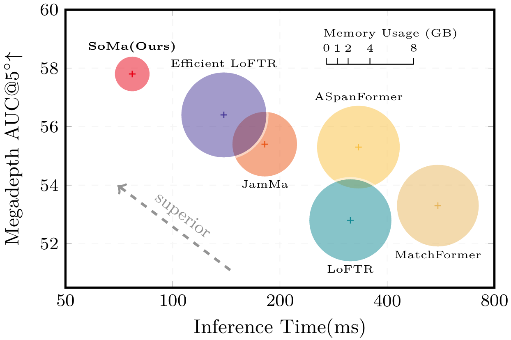
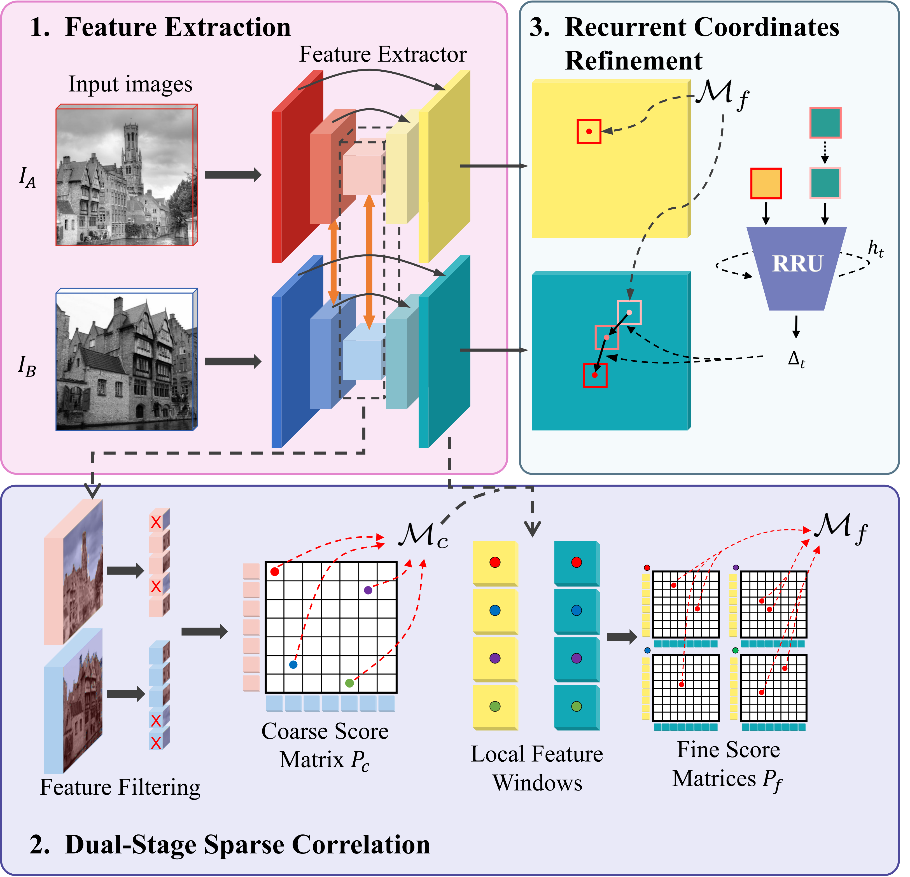

# Scalable Feature Matching via State Space Modeling and Sparse Correlation (CVPR 2026)
Choo Sin Wai, Bo Li\*  
\* corresponding author

<p align="center">
  
  
</p>

- [📰 News](#news)
- [✅ TODO](#todo)
- [⚙️ Installation](#installation-and-environment-setup)
- [📦 Pretrained model](#pretrained-model)
- [🏋️ Training](#training)
- [🧪 Testing](#testing)
- [📚 Citation](#citation)

## 📰 News
- [2026.02] Our paper is accepted by CVPR 2026.

## ✅ TODO
- [ ] Release train and test code.
- [ ] Release pre-trained models.

## ⚙️ Installation and environment setup

## 📦 Pretrained model

## 🏋️ Training

## 🧪 Testing

## 📚 Citation
```bibtex
@inproceedings{choo26soma,
  title={Scalable Feature Matching via State Space Modeling and Sparse Correlation},
  author={Choo, Sin Wai and Li, Bo},
  booktitle={Proceedings of the IEEE/CVF Conference on Computer Vision and Pattern Recognition (CVPR)},
  year={2026}
}
```
